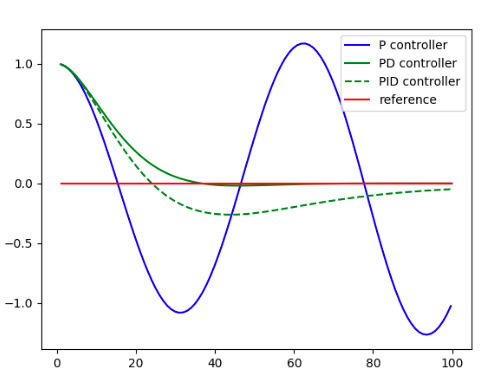
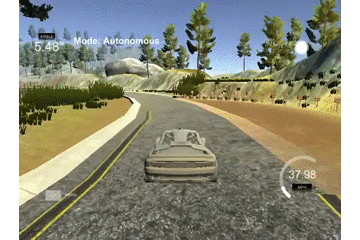
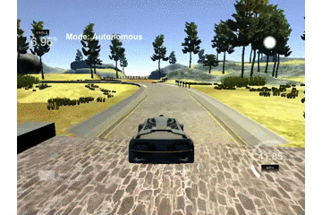
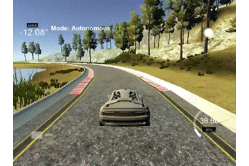

# PID Controller

## Basic Build Instructions

1. Clone this repo.
2. Make a build directory: `mkdir build && cd build`
3. Compile: `cmake .. && make`
4. Run it: `./pid`. 

Tips for setting up your environment can be found [here](https://classroom.udacity.com/nanodegrees/nd013/parts/40f38239-66b6-46ec-ae68-03afd8a601c8/modules/0949fca6-b379-42af-a919-ee50aa304e6a/lessons/f758c44c-5e40-4e01-93b5-1a82aa4e044f/concepts/23d376c7-0195-4276-bdf0-e02f1f3c665d)

## PID 

"A proportional–integral–derivative controller (PID controller or three term controller) is a control loop feedback mechanism widely used in industrial control systems and a variety of other applications requiring continuously modulated control. A PID controller continuously calculates an error value `e(t)`(CTE in this project the different between car and the middle of the road) as the difference between a desired setpoint (SP) and a measured process variable (PV) and applies a correction based on proportional(P), integral(I), and derivative(D) terms (denoted P, I, and D respectively) which give the controller its name." Quote from wiki plus explanation according to this project.


picture from PID Controller wiki - Imagine Plant/Process is our car control

* P part is to control how to respond to the error from the system `e(t)` or `Cross Track Error(CTE)` as I try to adjust, so this value will have an effect to how the car will steer the wheel back the center of the road or minimize `CTE` as much as possible so I can see why the car will swing so much if there are a lot of errors.

* I part is the integral part which is considered bias over time of the track (if any) `P` and `D` won't be enough if over the time there is small error added up.

* D part is the differential part which is a different part to control what magnitude to compensate the overshooting target when adjusting the control. 

Here is picture explained by Sebastian in Udacity



You can see the result when if control applies only `P`, `PD` and `PID`.

## Twiddle

I pick up `Kp`, `Ki` and `Kd` as 0.175, 0.00156953, 2.28 respectively because I run twiddle algorithms in the demo itself as described in `PID::Twiddle()` method. With a reset command, I can restart simulation as many times as I want.

To run twiddle I added a snippet in `main.cpp` to do an experiment if we set `enabledTwiddle` to true, those helper variables will have to be set.

```
  * Turn Twiddle on by setting enabledTwiddle to true
  * ************************************************
  */
  pid.enabledTwiddle = false;
  pid.counter = 0; //counter helper
  pid.counterReset = 2000; //how many counter to reset - 2000 is about one lap run
  pid.iterationCount = 20; //how many iteration to run twiddle
  pid.K = {Kp, Ki, Kd}; //use current Kp Ki Kd as starting point
  pid.dK = {0.3, 0.001, 0.3}; //params to adjust Kp Ki and Kd respectively
  /*
  * ************************************************
  */
```

The result after hours of the run and adjust itself, I can see the result as mentioned above with speed at 40 m/h to run at least 5 laps without crashing!

## Result





[Result of full video of driving a lap in 40m/h](./asset/Drive_result_40m.mp4)

